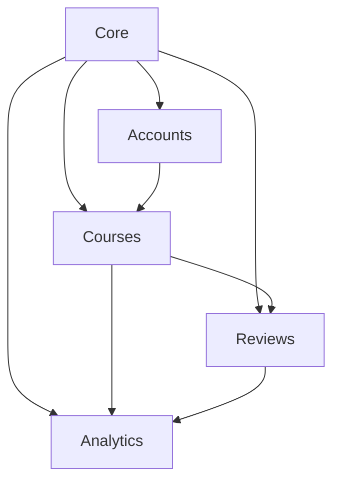

 # Структура бэкенда Ustat

## 1. Архитектура проекта

### 1.1 Основные приложения

#### Core (core)
- Базовые классы и утилиты
- Общие миксины и абстракции
- Базовые настройки API
- Кэширование и оптимизация

#### Аккаунты (accounts)
- Управление пользователями
- Профили и роли
- Аутентификация и авторизация
- Специализации и достижения

#### Курсы (courses)
- Управление курсами
- Модули и уроки
- Категории и теги
- Зачисления и прогресс

#### Отзывы (reviews)
- Отзывы о курсах
- Рейтинги
- Комментарии
- Модерация

#### Аналитика (analytics)
- Статистика курсов
- Отслеживание активности
- Метрики и отчеты
- Логирование событий

### 1.2 Взаимосвязи приложений



## 2. Модели данных

### 2.1 Accounts

#### User
```python
class User(AbstractUser):
    ROLE_CHOICES = [
        ('student', 'Студент'),
        ('teacher', 'Учитель'),
        ('producer', 'Продюсер'),
        ('admin', 'Администратор')
    ]
    
    role = CharField(max_length=20, choices=ROLE_CHOICES)
    bio = TextField()
    avatar = ImageField(upload_to='avatars/')
    phone = CharField(max_length=15, validators=[phone_regex])
    
    indexes = [
        Index(fields=['role', 'username']),
        Index(fields=['role', 'email']),
        Index(fields=['role'], condition=Q(is_active=True))
    ]
```

#### Profile
```python
class Profile(Model):
    user = OneToOneField(User, on_delete=CASCADE)
    rating = DecimalField(max_digits=5, decimal_places=2)
    social_links = JSONField()
    slug = SlugField(unique=True)
    specializations = ManyToManyField('Specialization')
    
    indexes = [
        Index(fields=['user', 'rating']),
        Index(fields=['slug'])
    ]
```

### 2.2 Courses

#### Course
```python
class Course(Model):
    STATUS_CHOICES = [
        ('draft', 'Черновик'),
        ('review', 'На проверке'),
        ('published', 'Опубликован'),
        ('archived', 'В архиве')
    ]
    
    title = CharField(max_length=200)
    slug = SlugField(unique=True)
    description = RichTextField()
    price = DecimalField(max_digits=10, decimal_places=2)
    teacher = ForeignKey(User, on_delete=CASCADE)
    category = ForeignKey('Category', on_delete=CASCADE)
    status = CharField(max_length=20, choices=STATUS_CHOICES)
    
    indexes = [
        Index(fields=['status', '-created_at']),
        Index(fields=['-average_rating']),
        Index(fields=['teacher', 'status'])
    ]
```

#### Module
```python
class Module(Model):
    course = ForeignKey(Course, on_delete=CASCADE)
    title = CharField(max_length=200)
    order = PositiveIntegerField()
    
    indexes = [
        Index(fields=['course', 'order'])
    ]
    
    class Meta:
        ordering = ['order']
```

### 2.3 Reviews

#### Review
```python
class Review(Model):
    course = ForeignKey(Course, on_delete=CASCADE)
    user = ForeignKey(User, on_delete=CASCADE)
    rating = PositiveSmallIntegerField(
        validators=[MinValueValidator(1), MaxValueValidator(5)]
    )
    text = TextField()
    
    indexes = [
        Index(fields=['course', '-created_at']),
        Index(fields=['user', '-created_at'])
    ]
    
    class Meta:
        unique_together = ['course', 'user']
```

### 2.4 Analytics

#### CourseAnalytics
```python
class CourseAnalytics(Model):
    course = OneToOneField(Course, on_delete=CASCADE)
    views_count = PositiveIntegerField(default=0)
    completion_rate = DecimalField(max_digits=5, decimal_places=2)
    revenue = DecimalField(max_digits=10, decimal_places=2)
    
    indexes = [
        Index(fields=['course', '-updated_at']),
        Index(fields=['-views_count']),
        Index(fields=['-revenue'])
    ]
```

## 3. API Endpoints

### 3.1 Accounts API
- `/api/v1/accounts/users/` - управление пользователями
- `/api/v1/accounts/profiles/` - профили пользователей
- `/api/v1/accounts/specializations/` - специализации

### 3.2 Courses API
- `/api/v1/courses/` - CRUD операции с курсами
- `/api/v1/courses/{slug}/modules/` - модули курса
- `/api/v1/courses/{slug}/lessons/` - уроки курса
- `/api/v1/courses/categories/` - категории курсов

### 3.3 Reviews API
- `/api/v1/reviews/` - отзывы о курсах
- `/api/v1/courses/{slug}/reviews/` - отзывы конкретного курса

### 3.4 Analytics API
- `/api/v1/analytics/courses/` - аналитика по курсам
- `/api/v1/analytics/users/` - аналитика по пользователям

## 4. Оптимизации

### 4.1 Кэширование
- Кэширование частых запросов через Redis
- Кэширование сессий
- Кэширование шаблонов

### 4.2 Индексы
- Составные индексы для частых запросов
- Частичные индексы для фильтрации
- Индексы для полнотекстового поиска

### 4.3 Запросы
- Использование select_related для ForeignKey
- Использование prefetch_related для ManyToMany
- Пагинация для больших наборов данных

### 4.4 Безопасность
- Аутентификация через JWT
- CORS настройки
- Rate limiting
- Валидация данных

## 5. Фоновые задачи (Celery)

### 5.1 Периодические задачи
- Обновление аналитики
- Очистка старых данных
- Отправка уведомлений

### 5.2 Асинхронные задачи
- Обработка загруженных файлов
- Отправка email
- Генерация отчетов

## 6. Мониторинг

### 6.1 Метрики
- Prometheus для сбора метрик
- Grafana для визуализации
- Логирование через ELK stack

### 6.2 Алерты
- Мониторинг ошибок
- Мониторинг производительности
- Оповещения о критических событиях

## 7. Оптимизации производительности

### 7.1 Кэширование через Redis

#### Стратегия кэширования
```python
# settings.py
CACHES = {
    'default': {
        'BACKEND': 'django_redis.cache.RedisCache',
        'LOCATION': 'redis://127.0.0.1:6379/1',
        'OPTIONS': {
            'CLIENT_CLASS': 'django_redis.client.DefaultClient',
            'PARSER_CLASS': 'redis.connection.HiredisParser',
            'CONNECTION_POOL_CLASS': 'redis.BlockingConnectionPool',
            'CONNECTION_POOL_CLASS_KWARGS': {
                'max_connections': 50,
                'timeout': 20,
            }
        }
    }
}

# Кэширование сессий
SESSION_ENGINE = "django.contrib.sessions.backends.cache"
SESSION_CACHE_ALIAS = "default"
```

#### Примеры кэширования
```python
# analytics/services.py
from django.core.cache import cache
from django.conf import settings

class CourseAnalyticsService:
    @staticmethod
    def get_top_courses(limit=10):
        cache_key = f'top_courses:{limit}'
        result = cache.get(cache_key)
        
        if result is None:
            result = Course.objects.annotate(
                avg_rating=Avg('reviews__rating')
            ).order_by('-avg_rating')[:limit]
            
            cache.set(cache_key, result, timeout=3600)  # 1 час
            
        return result
```

### 7.2 Асинхронные уведомления

#### WebSocket для real-time уведомлений
```python
# notifications/consumers.py
from channels.generic.websocket import AsyncJsonWebsocketConsumer

class NotificationConsumer(AsyncJsonWebsocketConsumer):
    async def connect(self):
        await self.channel_layer.group_add(
            f"user_{self.user.id}",
            self.channel_name
        )
        await self.accept()

    async def notify_review(self, event):
        await self.send_json({
            'type': 'new_review',
            'course': event['course'],
            'rating': event['rating']
        })
```

#### Celery для асинхронной обработки
```python
# tasks.py
@shared_task
def process_course_analytics(course_id):
    analytics = CourseAnalytics.objects.get(course_id=course_id)
    analytics.recalculate_metrics()
    
    # Отправка уведомления через WebSocket
    channel_layer = get_channel_layer()
    async_to_sync(channel_layer.group_send)(
        f"course_{course_id}",
        {
            "type": "analytics_update",
            "data": analytics.to_dict()
        }
    )
```

### 7.3 Шардирование базы данных

#### Конфигурация шардов
```python
# settings.py
DATABASE_ROUTERS = ['analytics.routers.AnalyticsRouter']

DATABASES = {
    'default': {
        'ENGINE': 'django.db.backends.postgresql',
        'NAME': 'ustat_main',
    },
    'analytics_shard_1': {
        'ENGINE': 'django.db.backends.postgresql',
        'NAME': 'ustat_analytics_1',
    },
    'analytics_shard_2': {
        'ENGINE': 'django.db.backends.postgresql',
        'NAME': 'ustat_analytics_2',
    }
}
```

#### Роутер для шардирования
```python
# analytics/routers.py
class AnalyticsRouter:
    def db_for_write(self, model, **hints):
        if model._meta.app_label == 'analytics':
            course_id = hints.get('course_id')
            return self.get_shard_for_course(course_id)
        return None

    def get_shard_for_course(self, course_id):
        shard_id = course_id % 2 + 1
        return f'analytics_shard_{shard_id}'
```

### 7.4 Версионирование API

#### Конфигурация URL
```python
# urls.py
urlpatterns = [
    path('api/v1/', include('api.v1.urls')),
    path('api/v2/', include('api.v2.urls')),
]
```

#### Версионированные viewsets
```python
# api/v2/views.py
class CourseViewSetV2(CourseViewSet):
    serializer_class = CourseSerializerV2
    
    def get_queryset(self):
        queryset = super().get_queryset()
        return queryset.prefetch_related(
            'modules',
            'reviews',
            Prefetch('analytics', queryset=CourseAnalytics.objects.select_related('performance'))
        )
```

### 7.5 Мониторинг производительности

#### Анализ медленных запросов
```python
# middleware.py
class QueryAnalyzerMiddleware:
    def __init__(self, get_response):
        self.get_response = get_response

    def __call__(self, request):
        start_time = time.time()
        response = self.get_response(request)
        duration = time.time() - start_time
        
        if duration > 1.0:  # Более 1 секунды
            queries = connection.queries
            slow_queries = [q for q in queries if float(q['time']) > 0.1]
            
            if slow_queries:
                logger.warning(f"Slow queries detected: {slow_queries}")
                
        return response
```

#### Prometheus метрики
```python
# metrics.py
from prometheus_client import Counter, Histogram

request_latency = Histogram(
    'http_request_latency_seconds',
    'HTTP request latency',
    ['method', 'endpoint']
)

db_query_latency = Histogram(
    'db_query_latency_seconds',
    'Database query latency',
    ['query_type']
)

cache_hits = Counter(
    'cache_hits_total',
    'Cache hit counter',
    ['cache_type']
)
```

### 7.6 Оптимизация запросов

#### Сложные запросы с аннотациями
```python
# courses/queries.py
from django.db.models import Count, Avg, F, Window
from django.db.models.functions import DenseRank

def get_trending_courses():
    return Course.objects.annotate(
        review_count=Count('reviews'),
        avg_rating=Avg('reviews__rating'),
        rank=Window(
            expression=DenseRank(),
            order_by=F('review_count').desc()
        )
    ).filter(
        status='published',
        review_count__gte=10
    ).select_related(
        'teacher',
        'category'
    ).prefetch_related(
        'tags',
        'modules'
    )
```

#### Оптимизация через материализованные представления
```sql
-- analytics/migrations/XXXX_create_course_stats_mv.py
CREATE MATERIALIZED VIEW course_stats_mv AS
SELECT 
    c.id AS course_id,
    COUNT(r.id) AS review_count,
    AVG(r.rating) AS avg_rating,
    COUNT(DISTINCT e.user_id) AS student_count
FROM 
    courses_course c
    LEFT JOIN reviews_review r ON c.id = r.course_id
    LEFT JOIN enrollments_enrollment e ON c.id = e.course_id
GROUP BY 
    c.id;

CREATE UNIQUE INDEX course_stats_mv_id ON course_stats_mv (course_id);
```

## 8. Улучшения бизнес-логики

### 8.1 Рекомендательная система

#### Модели для рекомендаций
```python
# recommendations/models.py
class UserPreference(models.Model):
    user = models.ForeignKey('accounts.User', on_delete=models.CASCADE)
    category = models.ForeignKey('courses.Category', on_delete=models.CASCADE)
    weight = models.FloatField(default=1.0)
    last_updated = models.DateTimeField(auto_now=True)

    class Meta:
        unique_together = ['user', 'category']
        indexes = [
            models.Index(fields=['user', '-weight']),
        ]

class CourseInteraction(models.Model):
    INTERACTION_TYPES = [
        ('view', 'Просмотр'),
        ('bookmark', 'Закладка'),
        ('start', 'Начало курса'),
        ('complete', 'Завершение'),
    ]

    user = models.ForeignKey('accounts.User', on_delete=models.CASCADE)
    course = models.ForeignKey('courses.Course', on_delete=models.CASCADE)
    interaction_type = models.CharField(max_length=20, choices=INTERACTION_TYPES)
    timestamp = models.DateTimeField(auto_now_add=True)

    class Meta:
        indexes = [
            models.Index(fields=['user', 'interaction_type', '-timestamp']),
        ]
```

#### Сервис рекомендаций
```python
# recommendations/services.py
from django.db.models import F, Sum, Window
from django.db.models.functions import Rank

class CourseRecommender:
    def __init__(self, user):
        self.user = user

    def get_recommendations(self, limit=10):
        # Получаем предпочтения пользователя
        user_preferences = UserPreference.objects.filter(
            user=self.user
        ).select_related('category')

        # Получаем курсы в интересующих категориях
        recommended_courses = Course.objects.filter(
            category__in=user_preferences.values('category'),
            status='published'
        ).annotate(
            preference_weight=Sum(
                Case(
                    When(
                        category__userpreference__user=self.user,
                        then=F('category__userpreference__weight')
                    ),
                    default=0.0
                )
            ),
            avg_rating=Avg('reviews__rating'),
            weighted_score=(F('avg_rating') * 0.7 + F('preference_weight') * 0.3),
            rank=Window(
                expression=Rank(),
                order_by=F('weighted_score').desc()
            )
        ).select_related(
            'teacher',
            'category'
        ).prefetch_related(
            'tags'
        )[:limit]

        return recommended_courses

    def update_preferences(self, course_interaction):
        """Обновляем предпочтения на основе взаимодействия с курсом"""
        category = course_interaction.course.category
        weight_change = {
            'view': 0.1,
            'bookmark': 0.3,
            'start': 0.5,
            'complete': 1.0
        }.get(course_interaction.interaction_type, 0.0)

        UserPreference.objects.update_or_create(
            user=self.user,
            category=category,
            defaults={
                'weight': F('weight') + weight_change
            }
        )
```

### 8.2 Многоязычность

#### Модели для переводов
```python
# core/models.py
class TranslatedField(models.Model):
    """Абстрактная модель для переводимых полей"""
    language = models.CharField(max_length=10, choices=settings.LANGUAGES)
    created_at = models.DateTimeField(auto_now_add=True)
    updated_at = models.DateTimeField(auto_now=True)

    class Meta:
        abstract = True
        unique_together = ['language', 'content_type', 'object_id']
        indexes = [
            models.Index(fields=['language', 'content_type', 'object_id']),
        ]

class CourseTranslation(TranslatedField):
    course = models.ForeignKey('courses.Course', on_delete=models.CASCADE)
    title = models.CharField(max_length=200)
    description = models.TextField()
    requirements = models.TextField()
    
    def __str__(self):
        return f"{self.course.title} ({self.language})"

class ModuleTranslation(TranslatedField):
    module = models.ForeignKey('courses.Module', on_delete=models.CASCADE)
    title = models.CharField(max_length=200)
    description = models.TextField()
```

#### Миксин для переводов
```python
# core/mixins.py
class TranslatedModelMixin:
    """Миксин для моделей с переводами"""
    
    def get_translation(self, language=None):
        if language is None:
            language = translation.get_language()
            
        translation_model = self.translations.model
        try:
            return self.translations.get(language=language)
        except translation_model.DoesNotExist:
            try:
                return self.translations.get(language=settings.LANGUAGE_CODE)
            except translation_model.DoesNotExist:
                return None

    def translate(self, language, **fields):
        translation_model = self.translations.model
        translation, created = translation_model.objects.update_or_create(
            content_object=self,
            language=language,
            defaults=fields
        )
        return translation
```

#### Сериализаторы с поддержкой переводов
```python
# courses/serializers.py
class CourseSerializer(serializers.ModelSerializer):
    translations = serializers.SerializerMethodField()

    class Meta:
        model = Course
        fields = [
            'id', 'slug', 'teacher', 'category',
            'price', 'status', 'translations'
        ]

    def get_translations(self, obj):
        language = self.context.get('language')
        if language:
            translation = obj.get_translation(language)
            if translation:
                return {
                    'title': translation.title,
                    'description': translation.description,
                    'requirements': translation.requirements
                }
        return None

    def to_representation(self, instance):
        data = super().to_representation(instance)
        translations = data.pop('translations', None)
        if translations:
            data.update(translations)
        return data
```

### 8.3 Интеграция улучшений

#### Middleware для определения языка
```python
# core/middleware.py
class LanguageMiddleware:
    def __init__(self, get_response):
        self.get_response = get_response

    def __call__(self, request):
        language = request.headers.get('Accept-Language', settings.LANGUAGE_CODE)
        translation.activate(language)
        response = self.get_response(request)
        translation.deactivate()
        return response
```

#### API для рекомендаций
```python
# recommendations/views.py
class RecommendationViewSet(viewsets.ReadOnlyModelViewSet):
    serializer_class = CourseSerializer
    permission_classes = [IsAuthenticated]

    def get_queryset(self):
        recommender = CourseRecommender(self.request.user)
        return recommender.get_recommendations()

    @action(detail=False, methods=['post'])
    def interact(self, request):
        course_id = request.data.get('course_id')
        interaction_type = request.data.get('type')
        
        interaction = CourseInteraction.objects.create(
            user=request.user,
            course_id=course_id,
            interaction_type=interaction_type
        )
        
        # Асинхронное обновление предпочтений
        update_user_preferences.delay(
            user_id=request.user.id,
            interaction_id=interaction.id
        )
        
        return Response(status=status.HTTP_201_CREATED)